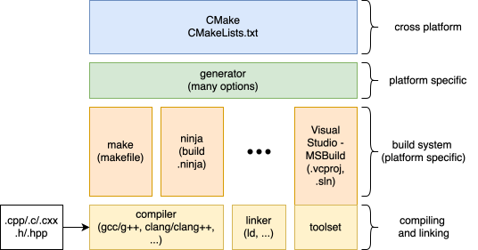
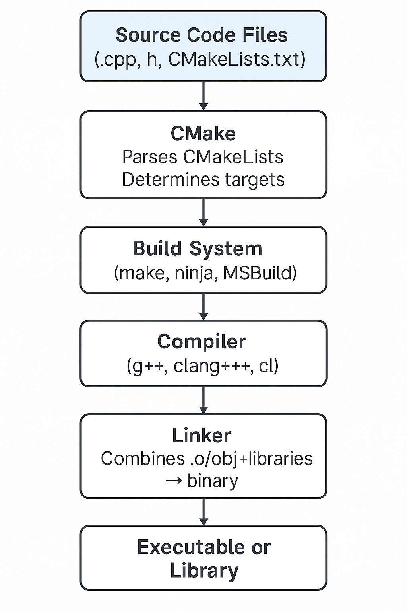

.. _about-the-build-system:

.. toctree::
   :hidden:

How The Build Works
===================

|

**1. Header and Source Files (Your Input Code)**

These are the starting point — your .cpp and .h files.
They contain the logic, declarations, and definitions that make up your program.

**2. CMake (The Build Configuration Tool)**

CMake is like the project manager.
You give it a high-level description of your project via CMakeLists.txt files:

- Which source files exist
- What targets (executables, libraries) to build
- What compiler flags or definitions to use
- What dependencies to link

CMake does not build anything itself. Instead, it generates files for the actual build system you'll use.

**3. Generators (The Output Format Specifier)**

CMake uses a generator to determine what kind of build system files to produce.

Examples of generators:

- Unix Makefiles → Generates Makefiles for use with make
- Ninja → Generates build.ninja files for ninja
- Visual Studio → Generates .sln and .vcxproj for MSVC IDE

You pick the generator depending on your platform or preference.

**4. Build System (The Build Executor)**

This is the tool that actually performs the build steps by following the instructions CMake generated:

- Make reads Makefile
- Ninja reads build.ninja
- Visual Studio/MSBuild reads solution/project files

It calls the compiler, tracks dependencies, and decides what needs rebuilding.

**5. Compiler (The Code Translator)**

The compiler (e.g., g++, clang++, cl.exe) compiles individual .cpp files into .o/.obj object files.

The compiler is invoked by the build system — not directly by CMake (except for test detection and introspection).

**6. Linker (The Final Assembler)**

After all source files are compiled, the linker combines them:

- It links object files and libraries into a single executable or shared/static library.
- It resolves symbols and dependencies.

The linker is usually invoked as part of the compiler toolchain (g++ or clang++ often handle linking too).

Each component hands off its results to the next — forming a pipeline from code to binary.

Summary
~~~~~~~

.. list-table:: Build Component Responsibilities
    :widths: 30 70
    :header-rows: 1

    * - Component
      - Responsibility
    * - Header/Source
      - Contains code logic and declarations
    * - CMake
      - Describes project structure/configuration
    * - Generator
      - Chooses format for build system files
    * - Build System
      - Executes compilation and linking steps
    * - Compiler
      - Translates source code into machine code (object files)
    * - Linker
      - Combines object files into final output
